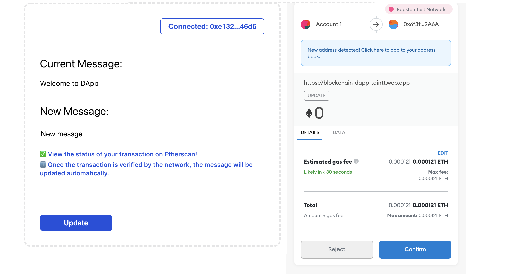
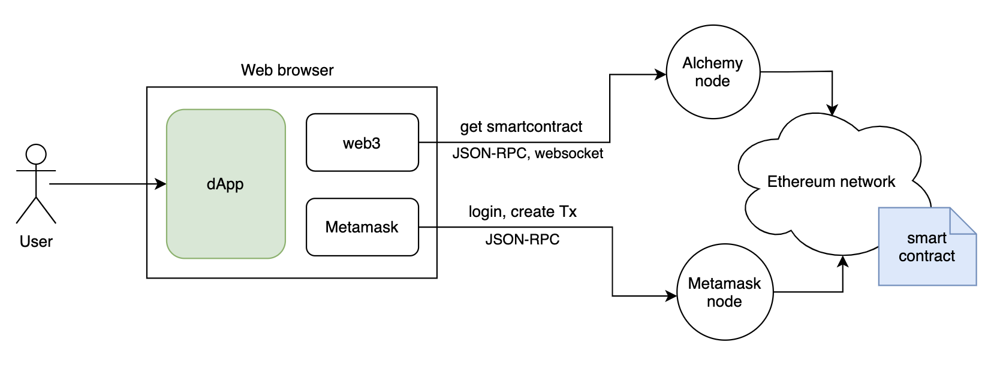

# Blockchain Dapp
A simple dApp with a React frontend to connect to the smart contract created at [blockchain-smartcontract](https://github.com/tainguyentt/blockchain-smartcontract) using Metamask and Web3 tools, following the blockchain series of Alchemy.



## Architecture Diagram
- Connect a Metamask wallet to your dApp project
- Read data from your smart contract using the Alchemy Web3 API
- Sign Ethereum transactions using Metamask



## Getting started
- Install the dependencies
```
npm install
```
- Start webserver
```
npm start
```

## Hosting in Firebase
- Create Firebase project
```
firebase login
firebase init
```
- Build project
```
yarn build
```
- Deploy to Firebase
```
firebase deploy
```

## Notes
- Alchemy Web3: 
a wrapper around Web3.js, providing enhanced API methods and other crucial benefits to make your life as a web3 developer easier. It is designed to require minimal configuration so you can start using it in your app right away!
- dotenv: 
to have a secure place to store our API key after we fetch it.
- Smart contract: view at [Etherscan](https://ropsten.etherscan.io/address/0x6f3f635a9762b47954229ea479b4541eaf402a6a#code)
